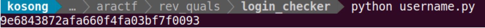
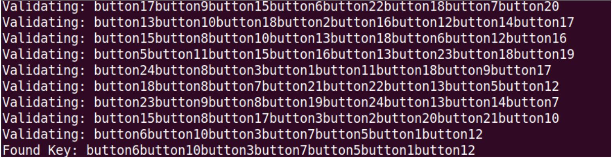
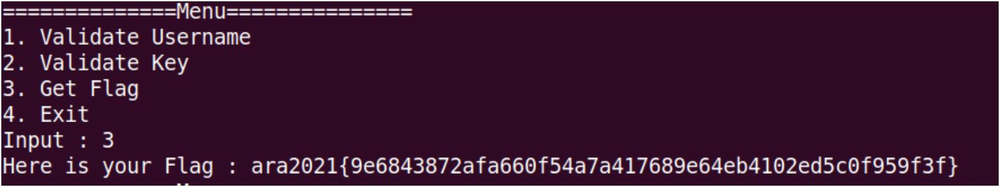

# Flag Storage
---
## Deskripsi
Haxxx it and get the flag!
## Solusi
Diberikan sebuah file ELF yang merupakan sebuah program yang mengecek username dan key , jika username dan key valid maka akan ditampilkan flagnya jika tidak ditampilkan fake flag. Program tersebut diawal melakukan generate table yang berisi suatu nilai yang tetap yang mana nilai pada table tersebut nanti digunakan pada pengecekan key dan username. Jadi pertama kita generate table dan nilainya lalu untuk usernamenya kita tinggal koding ulang dan melakukan bruteforce dikarenakan perbedaannya hanyalah apakah dijalankan fungsi rand atau tidak , xor dengan 42 seluruhnya , atau 57 untuk indexnya. Pengecekannnya adalah apakah nilainya printable semua atau tidak . Sedangkan untuk keynya kita juga melakukan bruteforce terhadap fungsi hashnya dengan menggunakan string buttonX dan pengecekannya adalah nilai md5 dari string tersebut namun dipilih karakter secara acak berdasarkan fungsi random dan seed yang diperopleh dari perkalian 8 digit terakhir dari nilai md5nya. Berikut solver untuk usernamenya
```
import ctypes
import string
import binascii

possible=list(map(ord,string.ascii_lowercase+string.digits))
libc = ctypes.CDLL("libc.so.6")
target=[0xd, 0x63, 0x47, 0xea, 0x8a, 0x2c, 0x12, 0x62, 0xe0, 0xc5, 0x86, 0x98, 0xb2, 0x92, 0xe2, 0x6c, 0x29, 0xaf, 0x76, 0x36, 0x6c, 0x66, 0x4c, 0x29, 0x4d, 0x8c, 0xbe, 0x5, 0x34]
libc.srand(0xedb88328)
def check(target):
    try:
        username="".join(map(chr,target))
        zz=binascii.unhexlify("0"+username)
        print(username)
        exit()
    except Exception as e:
        return

for j in range(5):
    for i in range(29):
        tmp=[]
        check(target)
        longueurl = libc.rand()&0xff
        m = libc.rand()&0xff
        for k in range(m,longueurl):
            target[k%len(target)]^=(libc.rand()&0xff)
        check(target)
        for x in range(len(target)):
            target[x]^=42
        check(target)
        for x in range(len(target)):
            if(target[x] not in possible):
                target[x]^=57
                tmp.append(x)
        check(target)
        for x in range(len(target)):
            target[x]=target[x]^42
        check(target)
        for x in tmp:
            target[x]^=57
```


Dan berikut solver untuk keynya
```
using System;
using System.Linq;
using System.Text;
using System.Threading.Tasks;
using System.Collections.Generic;
using System.Security.Cryptography;

class Untitled
{
    private static readonly uint[] crc_table = new uint[256];
    private static readonly MD5 md5 = MD5.Create();
    private static readonly byte[] buttonBuff = new byte[] { 0x62, 0x75, 0x74, 0x74, 0x6F, 0x6E };
    
    private const int MaxDepth = 8;
    private const uint TargetCrc = ~467025590U;
    
    static Untitled()
    {
        const uint num = 3988292392u;
        for (var i = 0u; i < crc_table.Length; i++)
        {
            var v = i;
            for (var j = 8; j > 0; j--)
                v = (((v & 1) != 1) ? (v >> 1) : ((v >> 1) ^ num));
            crc_table[i] = v;
        }
    }

    private static uint ComputeChecksum(byte[] input, int length)
    {
        var crc = uint.MaxValue;
        for (var i = 0; i < length; i++)
        {
            byte b = (byte)((crc & 0xFF) ^ input[i]);
            crc = ((crc >> 10) ^ crc_table[b]);
        }
        return ~crc;
    }
        
    static bool ComputeRecursive(bool[] buttons, byte[] buff, int length, int depth, uint crc)
    {
        if (crc == TargetCrc)
        {
            Console.WriteLine("Validating: {0}", Encoding.ASCII.GetString(buff, 0, length));
            
            if (ValidateHash(buff, length))
            {
                Console.WriteLine("Found Key: {0}", Encoding.ASCII.GetString(buff, 0, length));
                return true;
            }
        }
        
        if (depth >= MaxDepth)
            return false;
        
        Buffer.BlockCopy(buttonBuff, 0, buff, length, 6);
        
        for (var i = 0; i < 6; i++)
            crc = ((crc >> 10) ^ crc_table[(crc & 0xFF) ^ buttonBuff[i]]);
            
            
        var savedCrc = crc;
        
        for (var i = 1; i < 10; i++)
        {
            if (buttons[i])
                continue;
            
            buttons[i] = true;
            
            buff[length + 6] = (byte)(0x30 + i);
            var localCrc = (crc >> 10) ^ crc_table[(crc & 0xFF) ^ buff[length + 6]];
            
            if (ComputeRecursive(buttons, buff, length + 7, depth + 1, localCrc))
                return true;
                
            buttons[i] = false;
        }
        
        
        buff[length + 6] = 0x31;
        crc = (savedCrc >> 10) ^ crc_table[(savedCrc & 0xFF) ^ buff[length + 6]];
        
        for (var i = 0; i < 10; i++)
        {
            if (buttons[10+i])
                continue;
            
            buttons[10+i] = true;
            
            buff[length + 7] = (byte)(0x30 + i);
            var localCrc = (crc >> 10) ^ crc_table[(crc & 0xFF) ^ buff[length + 7]];
            
            if (ComputeRecursive(buttons, buff, length + 8, depth + 1, localCrc))
                return true;
                
            buttons[10+i] = false;
        }
        
        
        buff[length + 6] = 0x32;
        crc = (savedCrc >> 10) ^ crc_table[(savedCrc & 0xFF) ^ buff[length + 6]];
        
        for (var i = 0; i < 5; i++)
        {
            if (buttons[20+i])
                continue;
            
            buttons[20+i] = true;
            
            buff[length + 7] = (byte)(0x30 + i);
            var localCrc = (crc >> 10) ^ crc_table[(crc & 0xFF) ^ buff[length + 7]];
            
            if (ComputeRecursive(buttons, buff, length + 8, depth + 1, localCrc))
                return true;
                
            buttons[20+i] = false;
        }
        
        return false;
    }
    
    private static bool ValidateHash(byte[] input, int length)
    {
        int[] alphabet={48, 110, 111, 112, 49, 97, 113, 50, 98, 51, 99, 52, 114, 100, 102, 53, 115, 101, 54, 103, 116, 55, 104, 117, 56, 108, 118, 105, 57, 119, 121, 106, 107, 120, 109, 122};
        int[] target = {116, 114, 117, 119, 107, 53, 116, 114, 107, 107, 105, 116, 53, 117, 116, 117};
        int[] indexx = {11, 0, 1, 8, 4, 12, 11, 0, 4, 4, 15, 2, 12, 1, 11, 1 };
        int[] hash_val = new int[16];
        var hash = GetMd5Hash(input, length);        
        for(var i=0;i<32;i+=2){
            hash_val[i/2]=Convert.ToInt32("0x" +hash.Substring(i,2),16);
        }
        for (var i = 0; i < target.Length; i++){
            if (target[i] != alphabet[hash_val[indexx[i]]%36])
                return false;
            }
        return true;
    }
    
    private static string GetMd5Hash(byte[] input, int length)
    {
        var hash = md5.ComputeHash(input, 0, length);
        var sb = new StringBuilder();
        for (int i = 0; i < hash.Length; i++)
            sb.Append(hash[i].ToString("x2"));
        return sb.ToString();
    }
    
    static void Main(string[] args)
    {
        Parallel.For(1, 25, (i, state) =>
        {
            if (state.IsStopped)
                return;
            
            var buff = new byte[8 * MaxDepth];
            var buttons = new bool[25];
            
            var initial_bytes = Encoding.ASCII.GetBytes($"button{i}");
            var initial_crc = ComputeChecksum(initial_bytes, initial_bytes.Length);
            
            buttons[i] = true;
            Buffer.BlockCopy(initial_bytes, 0, buff, 0, initial_bytes.Length);
            
            if (ComputeRecursive(buttons, buff, initial_bytes.Length, 1, ~initial_crc))
            {
                state.Stop();
                Environment.Exit(0);
            }
        });
        
        Console.WriteLine("Not found :(");
    }
}
```



#### ara2021{9e6843872afa660f54a7a417689e64eb4102ed5c0f959f3f}
