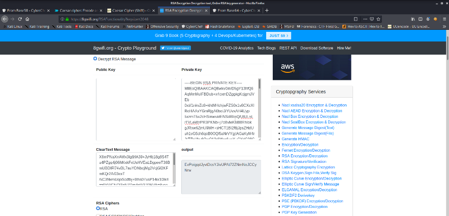
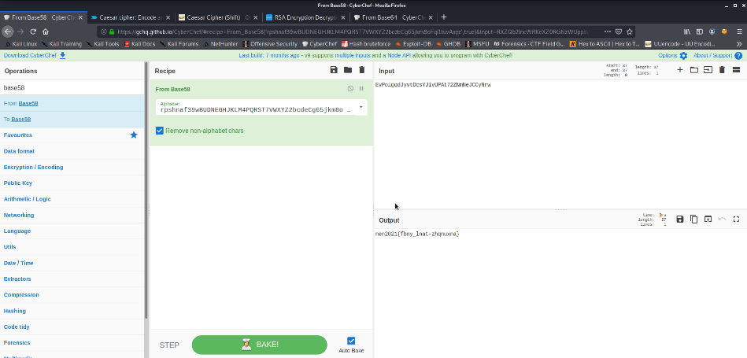
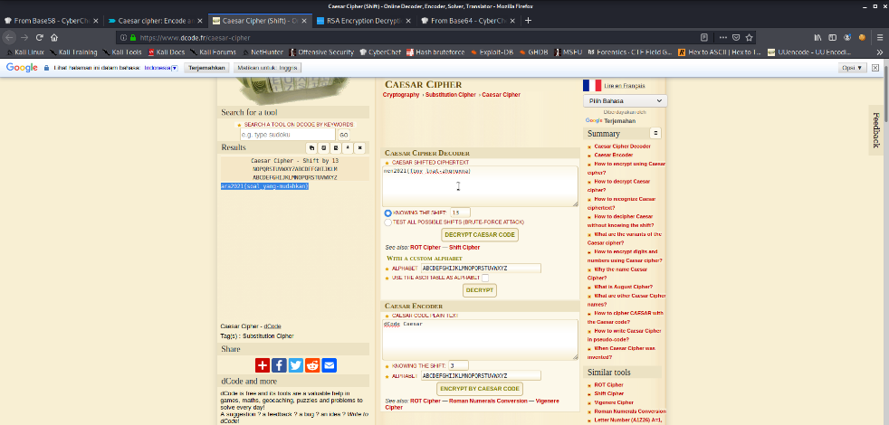

# Toko Online
---
## Deskripsi
RSA store merupakan toko yang sangat terkenal yang dikelola oleh seorang trader crypto yang menyukai mata uang ripple bersama kedua anaknya yang kembar sebut saja namanya adalah Ana dan Ina. Trader crypto tersebut bernama caesar rohman. Jangan lupa untuk membuka pintu dibutuhkan suatu kunci.
## Solusi
1.	Dibuat program sederhana untuk mendekripsi file pintu dengan private key pada file kunci dengan menggunakan RSA.
```
1.	from Crypto.PublicKey import RSA  
2.	from Crypto.Cipher import PKCS1_OAEP  
3.	import base64  
4.	import zlib  
5.	  
6.	def decrypt_blob(encrypted_blob, private_key):  
7.	  
8.	    #Impor Kunci Pribadi dan gunakan untuk dekripsi menggunakan PKCS1_OAEP  
9.	    rsakey = RSA.importKey(private_key)  
10.	    rsakey = PKCS1_OAEP.new(rsakey)  
11.	  
12.	    #Base 64 mendekode data  
13.	    encrypted_blob = base64.b64decode(encrypted_blob)  
14.	  
15.	    #Dalam menentukan ukuran potongan, tentukan panjang kunci pribadi yang digunakan dalam byte.  
16.	    #Data akan didekripsi dalam potongan-potongan  
17.	    chunk_size = 512  
18.	    offset = 0  
19.	    decrypted = ""  
20.	  
21.	    #pertahankan loop selama kita memiliki potongan untuk didekripsi  
22.	    while offset < len(encrypted_blob):  
23.	          
24.	        chunk = encrypted_blob[offset: offset + chunk_size]  
25.	  
26.	        # Tambahkan potongan yang didekripsi ke keseluruhan file yang didekripsi  
27.	        decrypted += rsakey.decrypt(chunk)  
28.	  
29.	        #Meningkatkan offset dengan ukuran potongan  
30.	        offset += chunk_size  
31.	  
32.	    #return data dekripsi yang telah didekompresi  
33.	    return zlib.decompress(decrypted)  
34.	  
35.	#Gunakan kunci pribadi untuk dekripsi  
36.	fd = open("kunci", "rb")  
37.	private_key = fd.read()  
38.	fd.close()  
39.	  
40.	# Masukan file untuk didekripsi  
41.	fd = open("pintu.tar", "rb")  
42.	encrypted_blob = fd.read()  
43.	fd.close()  
44.	  
45.	#File hasil dekripsi  
46.	fd = open("hasil", "wb")  
47.	fd.write(decrypt_blob(encrypted_blob, private_key))  
48.	fd.close()  
```
2.	Kemudian didapatkan dua file didalam file terinkripsi tersebut yaitu message dan key, selanjutnya dari key dan message tersebut lakukan dekripsi dengan menggunakan RSA dengan private keynya dari file key.txt dan message dari message.txt maka akan didapatkan sebuah teks terenkripsi yaitu ```EvPoigqdJyvtDcsYJivUPAt72ZNmNeJCCyNrw```.
 

3.	Dari soal terdapat petunjuk bahwa trader crypto tersebut menyukai mata uang ripple hal ini menunjukan bahwa teks yang terenkripsi tersebut dienkripsi menggunakan base58 dengan tipe enkripsi adalah ripple.
 

Didapatkan hasil ```nen2021{fbny_lnat-zhqnuxna}```
4.	Selanjutnya dilakukan dekripsi dengan menggunakan caesar cipher dimana dalam soal terdapat petunjuk yaitu trader tersebut bernama caesar. 

#### ara2021{soal_yang-mudahkan}