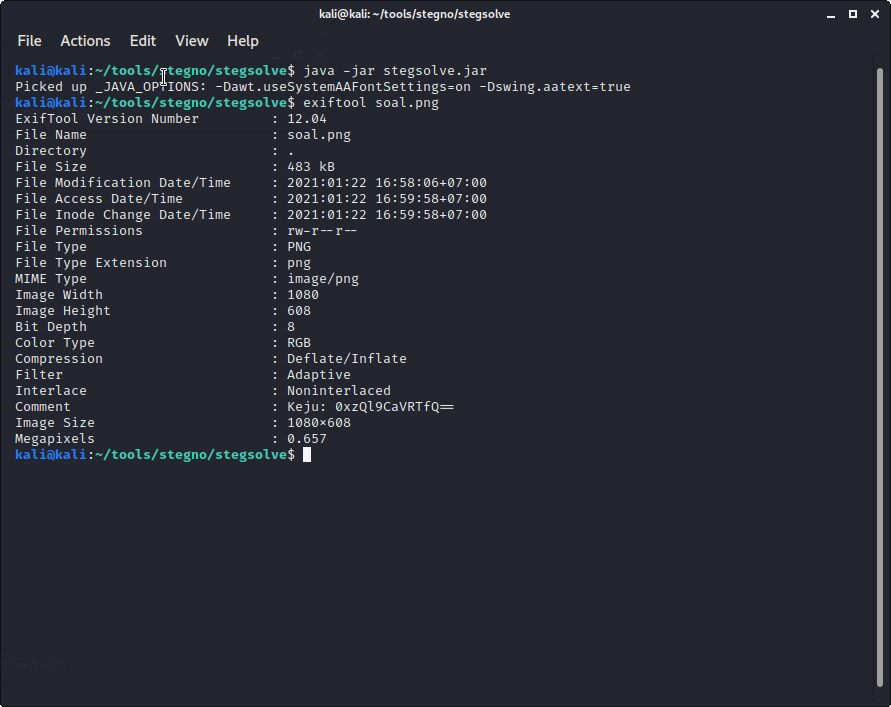
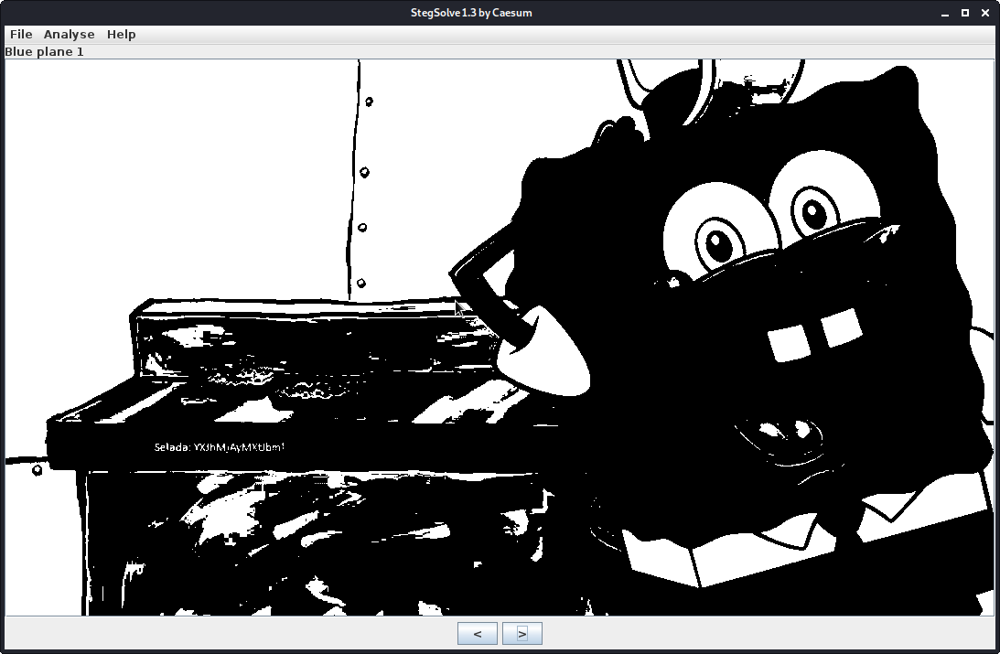
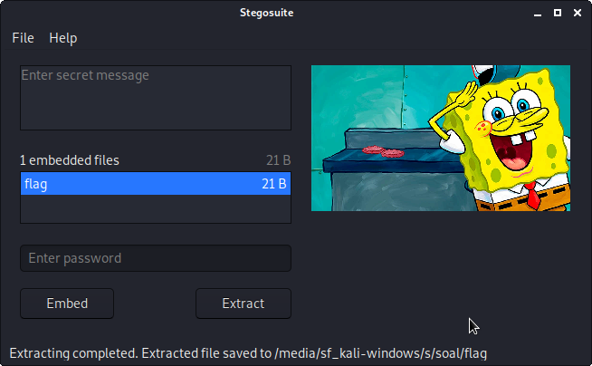
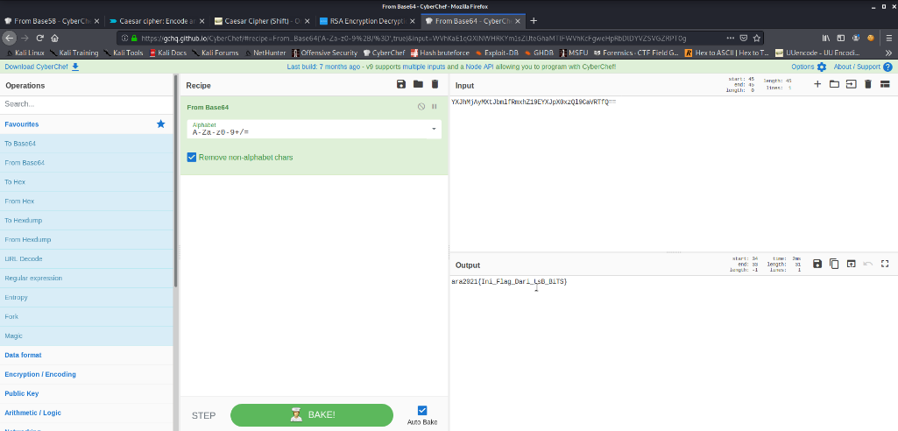

# Koki Yang Handal
---
## Deskripsi
Spongebob adalah seorang koki yang setiap hari membalikkan daging diatas panggangan.  Kemudian dari daging tersebut ia susun sebanyak 3 tumpukan didalam roti yaitu tumpukan ke-1 selada, selanjutnya daging, dan keju. Suatu ketika restoran tempat ia bekerja kekurangan ke tiga bahan tersebut. Bantu spongebob untuk mencari ketiga bahan kemudian susun sesuai tumpukan dan lakukan pemanggangan.
## Solusi
1.	Untuk Menyelesaikan soal tersebut, maka hal pertama yang dilakukan adalah mengecek metadadata dari gambar dengan menggunakan exiftools dan ditemukan hasil sebagai berikut:

Maka didapatkan flag adalah: ```Keju: 0xzQl9CaVRTfQ==```
2.	Kemudian dari soal terdapat pernyataan bahwa spongebob membalikkan daging diatas panggangan, maka kemungkinan terdapat sesuatu didekat panggangan. Selanjutnya digunakan tools StegSolve untuk mengeceknya. Maka saat menggunakan stegsolve dengan Blue plane 1 ditemukan flag yaitu ```Selada: YXJhMjAyMXtJbml```
 

3.	Selanjutnya lakukan pengecekan apakah gambar disisipkan file dengan menggunakan stegosuite dan ternyata terdapat file dengan nama flag. Buka file tersebut dan didapatkan flag yaitu: ```Daging: fRmxhZ19EYXJpX```

 
4.	Selanjutnya susun ketiga flag tersebut sesuai dengan susunan yang dilakukan spongebob, maka didapatkan text terenkripsi ```YXJhMjAyMXtJbmlfRmxhZ19EYXJpX0xzQl9CaVRTfQ==``` Kemudian lakukan dekripsi dengan menggunakan base64.
 
#### ara2021{Ini_Flag_Dari_LsB_BiTS}