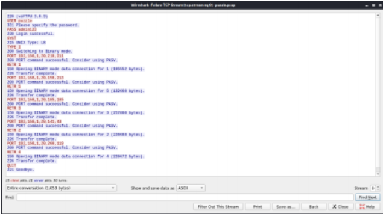
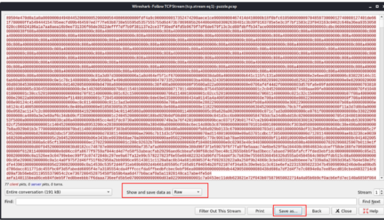

# Puzzle
---
## Deskripsi
Kamu disuruh untuk mencari tahu file file yang berhasil diambil oleh Hacker dimana file-file tersebut jika disusun akan membentuk sebuah gambar yang berisikan flag rahasia. Temukan dan kamu berkesempatan untuk terpilih menjadi Blue Team di Telkom Indonesia

## Solusi
Diberikan sebuah PCAP dimana dideskripsinya sudah sangat jelas terdapat sebuah file yang  dicuri oleh hacker dimana file tersebut jika digabungkan akan muncul sebuah gambar yang  berisikan flag rahasia. Langsung saja analisis file PCAP tersebut menggunakan wireshark.  Tinggal Follow TCP stream maka akan terlihat adanya FTP


Terlihat adanya pengunduhan file 1,5,3,2,4. Setelah itu tinggal export semua RAW file  tersebut dari stream 1 sampai 5 namai file sesuai urutan dari pengunduhan file.



Karena judulnya PUZZLE bisa ditebak kita harus mengurutkan file file tersebut dari 1 sampai  5 dan digabungkan akan menjadi sebuah file gambar berformat png. Disini saya sudah  membuatkan sebuh kodingan menggunakan python 
```
#!/usr/bin/python3 
import binascii 
content ="" 
#umpamakan nama filenya 1 sampai 5 
for filename in range (1,6): 
    with open(str(filename), 'rb') as file: 
    #ubah hex 
        content += file.read().hex() 
#return binary data 
content = binascii.a2b_hex(content) 
with open("solve.png",'wb') as file: 
    file.write(content)
```
#### ara2021{F0LlOw_Tcp_Str34M}
