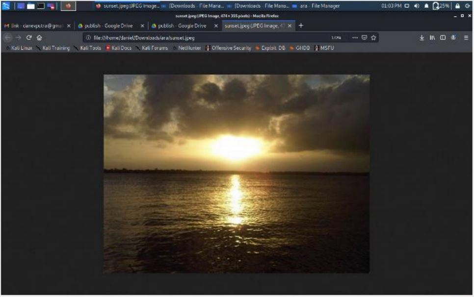
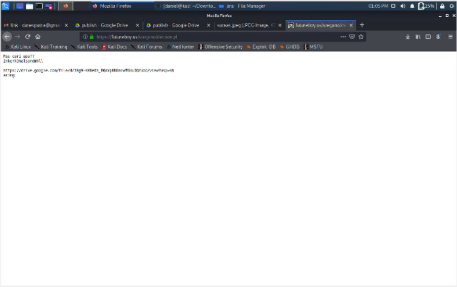
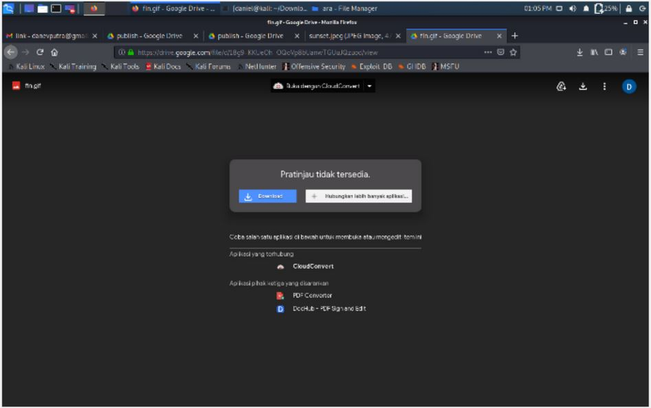
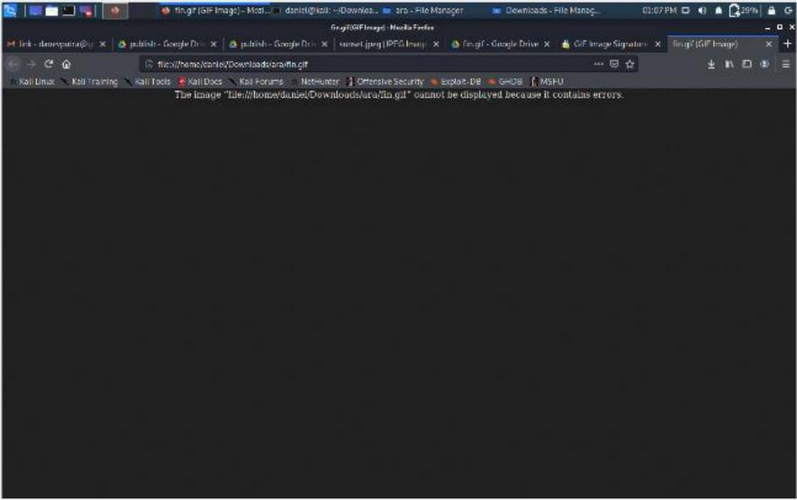
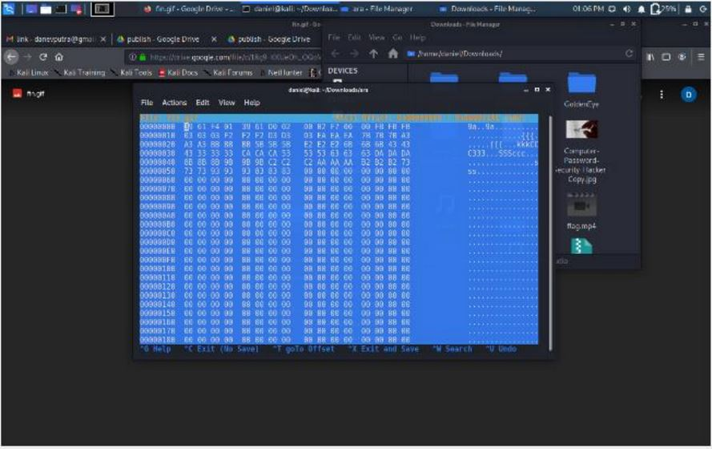
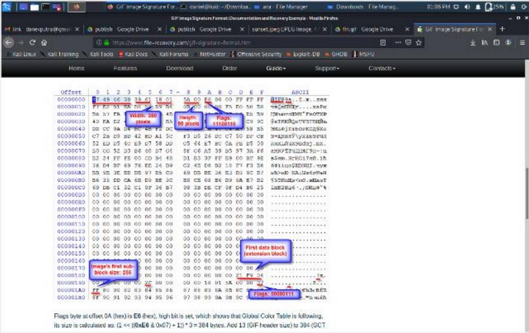
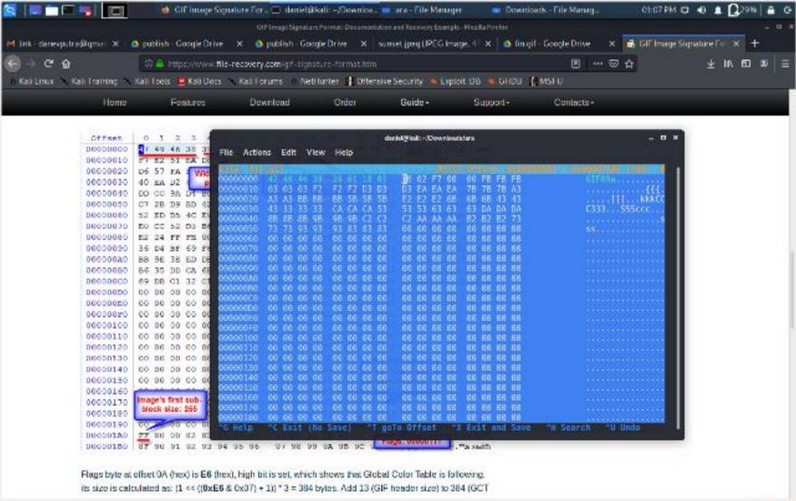
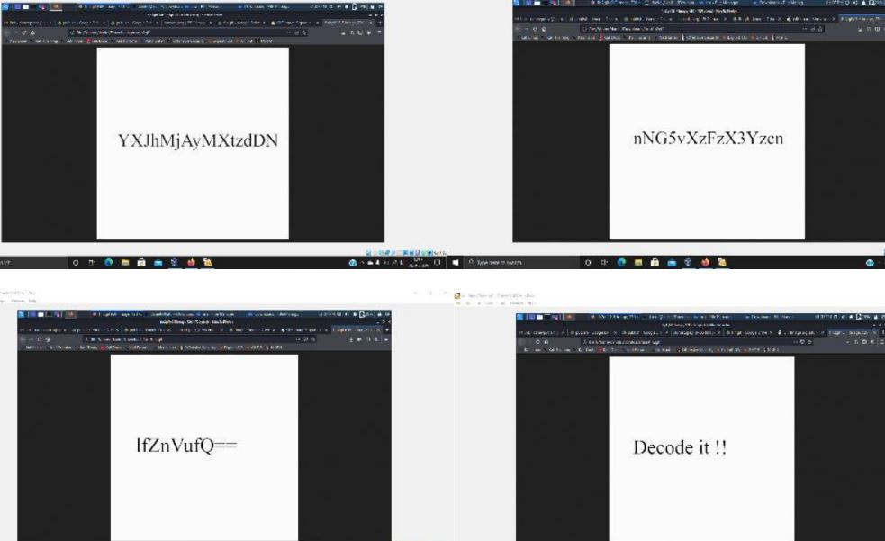
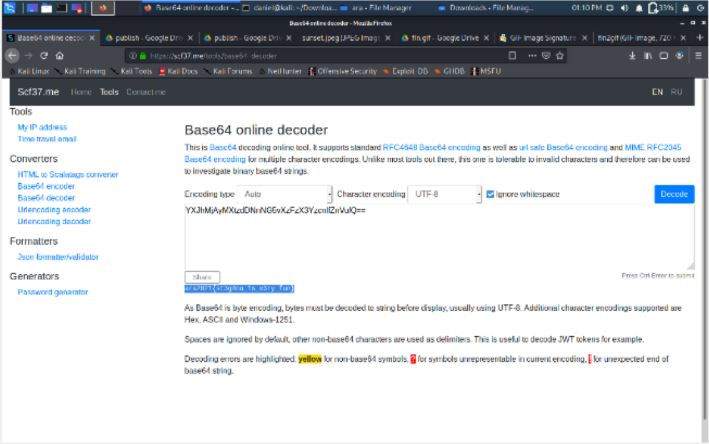

# Recover it!
---
## Deskripsi
Pada suatu hari PT. Telkom mendapat kiriman sebuah gambar dengan pesan "Gambar ini sudah dirusak dengan kunci kosong". Bantulah PT. Telkom untuk memecahkan misteri ini.
## Solusi
1. Peserta akan diberi sebuah gambar (sunset.jpg), seperti dibawah ini. Dalam gambar ini disisipi informasi untuk menuju ke gambar kedua  
2. Mengekstrak informasi yang ada dalam gambar  
3. Menuju dan mendownload gambar kedua yang ada dalam drive tersebut  
4. Setelah di download gif tersebut belum bisa dibuka  
5. Menggunakan hex editor untuk merecover file gif  
6. Menyesuaikan hex dengan hex signature dari gif   
7. Setelah itu maka gif dapat dibuka  
8. Mendekripsi pesan dengan base 64  

#### ara2021{st3g4no_1s_v3ry_fun}
