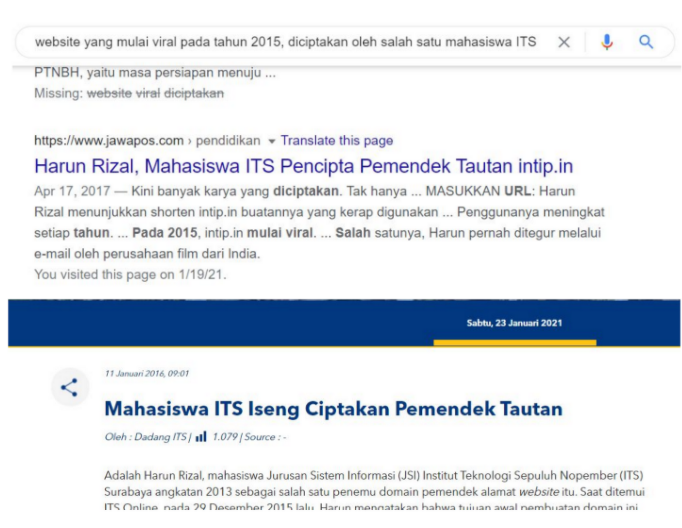
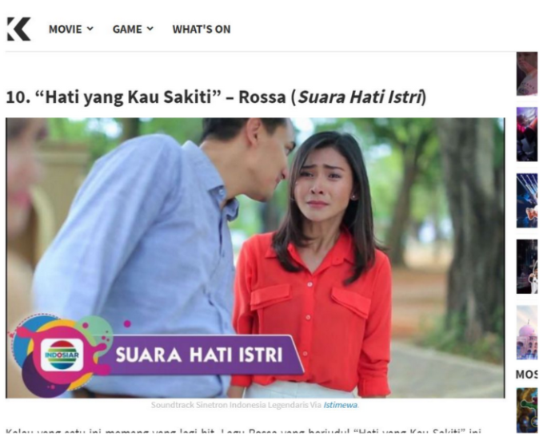
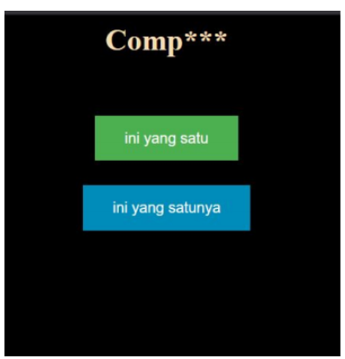
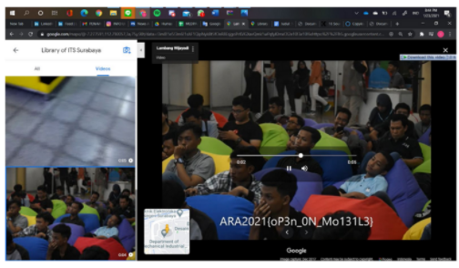

# We Promise No shit!
---
## Deskripsi
PT Pama Persada sedang membuat sayembara untuk memecahkan teka-teki yang mereka buat, cari tau siapa aku dan dia maka kamu akan menemukan harta karunya!

Aku merupakan website yang mulai viral pada tahun 2015, diciptakan oleh salah satu alumni dari kampus penyelenggara ARA CTF ini. Beritaku di upload di kanal its pada tanggal 11 januari 2016 aku senang sekali waktu itu.

Dia adalah judul lagu yang dinyanyikan oleh salah satu diva di Indonesia, dan mungkin keluargamu sering mendengarkannya di tv, kadang bercerita tentang karma.

Coba ketik ini di halamannya mbahmu yang terkenal itu :
aku/dia

Mungkin lebih sopan untuk nulisnya huruf kecil semua

## Solusi
Dari kata aku yang jika ditelusuri melalui google maka akan dimunculkan beberapa berita yang mengarah pada salah satu shortcut yang sering digunakan yaitu intip.in, pada kalimat perintah untuk mengetik di halaman mbahmu (google) maka diharapkan bisa ada sense bahwa ‘aku’ adalah website pemendek url. 




untuk ‘dia’ disini yang dimaksud adalah soundtrack dari sinetron azab yang akhir akhir ini begitu viral. pada deskripsi terdapat beberapa keyword seperti ‘judul lagu’, ‘diva’, ‘TV’ dan ‘karma’, dengan sedikit penelusuran tentang soundtrack dari sinetron azab maka didapatkan judul lagu rosa yaitu :

https://intip.in/hatiyangkausakiti 
url tersebut akan mengarah pada website yang tampilanya seperti ini. disitu terdapat clue comp*** yang dimaksud adalah perintah untuk compare / membandingkan tulisan yang terdapat pada kedua buah url.
hasil setelah dibandingkan


kata yang berbeda :

```HMIT adalah himpunan mahasiswa teknologi informasi lokasi HMIT? perpustakaan its coba cari di maps ```
kemudian melihat perpustakaan ITS di maps yang pada video terdapat :

#### ara2021{oP3n_0N_Mo131L3}
