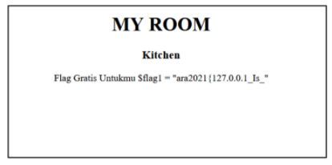
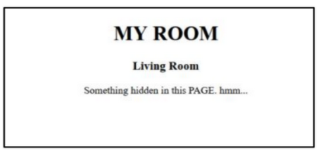

# HOME
---
## Deskripsi
Telkom Indonesia telah membuat website dimana didalamnya terdapat sebuah flag yang disembunyikan. Hmm sepertinya terdapat IP filtering di dalamnya 
## Solusi
Di deskripsinya sudah jelas adanya IP filtering pada website ini dan sudah jelas juga Ketika  mengakses website home muncul clue berupa Quote “Stand Your Ground, Keep Going  FORWARD”. Disini bisa disimpulkan tinggal menambahkan X-Forwarded-For 127.0.0.1 sesuai  judulnya yaitu HOME bisa ditebak mengarah ke 127.0.0.1 
Maka akan tampil websitenya. Flag 1 dapat didapatkan dengan mengakses Kitchen 



Flag 2 dapat didapatkan melalui Living Room.  



Dapat dilihat adanya indikasi celah keamanan File Inclusion. Dan terdapat clue “Something hidden  in this PAGE”. Dengan menggunakan Wrapper php://filter dapat melihat kodingan dari halaman  tersebut. Payloadnya 
```

http://IP/select.php?room=php://filter/convert.base64-encode/resource=livingroom.php


```
Tinggal di decode menggunakan BASE 64 dan akan mendapatkan flag kedua 
Flag terakhir terdapat di Bedroom. Sudah diberitahu bahwa flag terakhir ada di /etc/flag3.txt.  Tetapi ternyata terdapat filtering menggunakan str_replace yang mengganti setiap ‘../’ dan ‘txt’  menjadi ‘’
Hal tersebut dapat di bypass dengan menggunakan payload berikut:
```
http://IP/select.php?room=..././..././.../.././etc/flag3.ttxtxtxtttxt
```
#### ara2021{127.0.0.1_Is_wH3re_0uR_St0rY_B3Gins}