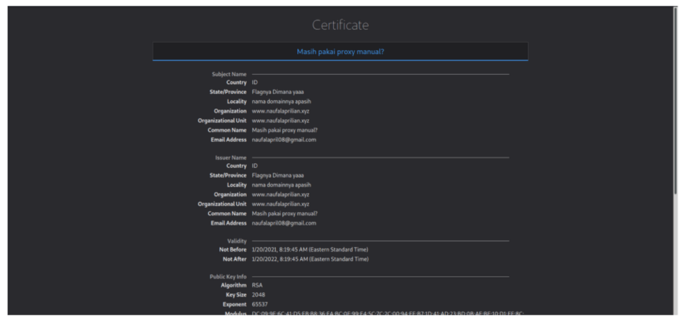

# Not Secure
---
## Deskripsi
untuk menguji kemampuan pentesting kamu, Telkom Indonesia memberikanmu sebuah website yang 'Not Secure'
## Solusi
Dari judulnya sepertinya sudah bisa ditebak terkait tentang certificate. Dapat diakses  websitenya  

Tinggal akses https:// untuk dapat melihat detail certificate. Ketika masih pakai proxy maka  hint selanjutnya akan tertutupi maknnya terdapat tulisan “masih pakai proxy manual?” 

Tinggal proxynya dimatikan maka akan muncul hint selanjutnya

Tinggal akses domainnya akan muncul flag 
#### ara2021{p3nt1n6nya53rt1vik4sih}